# Anse — zakázky: kompletní specifikace

> ⚠️ **Historický dokument.** Popisuje stav k 12. 8. 2026 — před přestavbou
> z 27.–28. 8. 2026 (kontakty s přidělováním, pět fází místo stavů, dva pohledy
> technik/kancelář, dvouúrovňový katalog, notifikace per uživatel). Aktuální
> přehled: [`README.md`](../README.md) v rootu, procesně
> [`proces-zakazky.html`](./proces-zakazky.html), pravidla `CLAUDE.md`.

> Referenční dokument pro AI/vývojáře, kteří na projektu pokračují.
> Stav k **12. 8. 2026**, commit `331c3dd`, 31 commitů, ~10 400 řádků TS/TSX/CSS.
> Produkce: <https://anse-zakazky.netlify.app> · repo: `Webkit-Studio/anse-zakazky`
>
> Doplňkové dokumenty: [`notifikace-resend.md`](./notifikace-resend.md) (zprovoznění e-mailů),
> [`dns-zaznamy-pro-spravce.txt`](./dns-zaznamy-pro-spravce.txt), `CLAUDE.md` v rootu (build konvence).
> **Zdroj pravdy pro zadání je Notion** (stránka „Vývoj interní aplikace"); tento soubor popisuje stav kódu.

---

## 1. Co to je a proč

Interní webová aplikace pro **FWDS Europe, a.s.** (značka **Anse**) — montáže stínicí techniky
(žaluzie, sítě, rolety, screeny, plissé).

**Problém, který řeší:** montážní parta měří u zákazníků, ale objednává kancelář. Při předávání
podkladů se ztrácely parametry (prohozená výška/šířka, barva lamel, šířka rámu — každý produkt má
jiná povinná pole). Aplikace = strukturované produktové formuláře, které si správné údaje vynutí.

**Uživatelé:** 4 účty (2–3 admini v kanceláři, 1–2 technici v terénu). Technik vyplňuje z telefonu
u zákazníka, admin objednává z kanceláře.

**Priority při trade-offech (v tomto pořadí, závazné):**
1. **Rychlost vyplnění formuláře** v terénu
2. **Jednoduchost** — minimum kroků, žádné zbytečné obrazovky
3. **Spolehlivost dat** — povinná pole, validace proti záměně rozměrů
4. **Škálovatelnost formulářů** — nový produkt = konfigurace, ne kód

**Obchodní rámec:** dodavatel Webkit.Studio (Lukáš Svoboda), cena v1 12 000 Kč, poté 90 dnů úprav
podle zpětné vazby zdarma. **Provoz musí být zdarma** — proto výhradně free tiery (Netlify,
Supabase, Resend). Kontakt na straně klienta: Marek Konderla (CEO).

---

## 2. Rychlý start

```bash
npm install
cp .env.example .env          # doplnit DATABASE_URL, DIRECT_DATABASE_URL, JWT_SECRET

npm run dev                   # Vite na :5173 (proxuje /api a /export na :8788)
npm run dev:api               # API server na :8788 (stejný handler jako Netlify funkce)

npm run build                 # tsc --noEmit && vite build
npm test                      # Vitest: 41 testů (form-engine, print, codes, email)
npm run test:e2e              # Playwright smoke, mobilní viewport (Pixel 7)
npm run validate:definitions  # zod kontrola JSON definic formulářů
npm run migrate               # db/migrations/*.sql (DIRECT_DATABASE_URL)
npm run seed                  # uživatelé + typy produktů + definice (idempotentní)
npm run gen:lamely            # náhledy barev lamel z images/*.jpg → public/lamely/
```

**Lokální Postgres v sandboxu** (bez Dockeru): initdb + pg_ctl pod uživatelem `pg`, port 5433,
DB `anse`, connection string `postgres://postgres@localhost:5433/anse` do obou DB proměnných.
Spuštění: `su pg -s /bin/bash -c "/usr/lib/postgresql/16/bin/pg_ctl -D /home/pg/pgdata -l /home/pg/pgdata/log start"`.

**E2E v sandboxu:** `PLAYWRIGHT_CHROMIUM_PATH=/opt/pw-browsers/chromium npm run test:e2e`.
Nikdy nespouštět `playwright install`. `e2e/global-setup.ts` nastaví testovací kódy
**111111** (Jakub Svoboda, technik) a **999999** (Marek Konderla, admin) — jen proti localhost DB.

---

## 3. Tech stack a architektonická rozhodnutí

| Vrstva | Volba | Proč |
| --- | --- | --- |
| Frontend | Vite + React 18 + TypeScript (strict), react-router-dom 6, TanStack Query 5 | SPA, žádný SSR není potřeba |
| Styly | **čisté CSS s custom properties**, žádný framework | plná kontrola nad mobilním UI, nulová váha navíc |
| Fonty | Inter Variable + Space Grotesk Variable přes `@fontsource` (self-host) | prémiový vzhled bez externího CDN |
| Backend | **jediná Netlify funkce** `api.ts` s vlastním routerem | free tier, jednoduchý deploy |
| Export | oddělená funkce `export.ts` (pdf-lib + embedovaný font) | těžké závislosti nesmí nafouknout hlavní API bundle |
| Keepalive | scheduled funkce `ping.ts`, cron `*/5 * * * *` | brání pauze Supabase free tieru, čistí `login_attempts` |
| DB | Supabase free (Postgres, EU-Frankfurt) přes **postgres.js** | plné SQL (CAS přechody, transakce), stejný kód lokálně i v produkci |
| Auth | 6místný kód → JWT HS256 v HttpOnly cookie | 4 uživatelé, žádný e-mail auth |
| E-maily | Resend free (region eu-west-1) | 3 000 zpráv/měsíc zdarma |
| PDF | pdf-lib + Liberation Sans embedovaný jako base64 | české glyfy; standardní PDF fonty je nemají |

### Nepřekročitelná pravidla

1. **Vše přes `/api/*`** — jediná funkce, router v `server/handler.ts`. Klient **nikdy** nemluví
   přímo s DB ani s třetí stranou.
2. **`shared/` je čisté** — bez IO, bez Node API. Importuje ho klient i server; validace formulářů
   běží identicky na obou stranách.
3. **Server nikdy nevěří klientovi** — params se revalidují proti připnuté verzi definice,
   `position` a `product_type_id` přiděluje server, role se kontroluje per routa.
4. **Stavy jen vpřed**, žádné vracení (viz §6).
5. **UI výhradně česky**, chybové hlášky přímo u pole.
6. **Touch targety min. 48 px** (`--tap`), číselná pole `inputmode`, fonty inputů min. 16 px
   (jinak iOS zoomuje).
7. **Zelená `--c-green` se nikdy nepoužívá jako barva textu na bílé** (nedostatečný kontrast) —
   jen plochy a akcenty; zelený text řeší tmavá `--c-green-deep`.
8. **Secrets nikdy s prefixem `VITE_`** (dostaly by se do bundle).

---

## 4. Mapa repozitáře

```
shared/                      # čistá logika sdílená klientem i serverem
  types.ts                   # role, stavy + ALLOWED_TRANSITIONS, řádkové typy
  form-schema.ts             # zod schéma definice formuláře (groups/fields/rules/printMap)
  form-engine/
    conditions.ts            # isEmpty, evalCond, evalConds (eq/neq/in, pole = AND)
    visibility.ts            # allFields, isFieldVisible, pruneHidden
    validate.ts              # validateItem — jediná pravda o validaci
    index.ts                 # re-export + initialParams
  print.ts                   # aggregateForList, totalPieces, missingForPdf
  api-contracts.ts           # zod schémata request bodies
  codes.ts                   # CODE_REGEX, isTrivialCode

server/                      # běží jen na serveru
  handler.ts                 # router + auth middleware (vstupní bod API)
  router.ts                  # makeRoute, matchRoute, checkCsrf, requireAdmin
  http.ts                    # ApiError, json(), errorResponse(), withCookie()
  db.ts                      # postgres.js singleton (prepare:false, max:1)
  auth.ts                    # login, rate-limity, JWT, cookies, cache aktivních uživatelů
  email.ts                   # Resend: šablony + deliver() + sendStatusMail/sendTestMail
  export/
    montazni-list-pdf.ts     # generátor PDF montážního listu
    font.b64.ts              # Liberation Sans (generováno scripts/gen-font.ts)
  routes/                    # orders, items, clients, rooms, users, settings, stats,
                             # product-types, auth-routes

src/                         # React SPA
  router.tsx                 # cesty + RequireAuth / RequireAdmin
  api/{client,hooks}.ts      # fetch wrapper + React Query hooky
  components/                # ui.tsx (Button, Field, SelectSheet, ConfirmButton…),
                             # AppLayout, Logo, ProductIcon, PhoneInput, SignaturePad,
                             # OrderAction, Toast
  form-engine/
    DefinitionForm.tsx       # renderer definice → formulář
    useDraft.ts              # autosave rozepsané položky do localStorage
  pages/                     # Login, Dashboard, Orders, OrderNew, OrderDetail,
                             # ItemForm, Admin, Stats
  styles/{tokens,base,ui}.css

db/
  migrations/001–006*.sql    # verzované migrace (aplikuje scripts/migrate.ts)
  seeds/product-types.json   # seznam typů produktů
  seeds/definitions/*.json   # definice formulářů (sel15, esd, plisse)

netlify/functions/           # api.ts (/api/*), export.ts (/export/*), ping.ts (cron)
scripts/                     # migrate, seed, validate-definitions, dev-api,
                             # gen-font, gen-lamely-thumbs, lib/env.ts
e2e/                         # smoke.spec.ts + global-setup.ts
docs/                        # SPEC.md (tento soubor), notifikace-resend.md, screens/
images/                      # zdrojové fotky lamel + logo (mimo build)
public/lamely/*.webp         # 46 vygenerovaných náhledů barev lamel
```

---

## 5. Datový model

Schéma vzniklo migrací `001_init.sql`, dalších pět migrací ho rozšířilo. **Efektivní stav:**

### `users`
`id uuid PK` · `name text` · `code char(6) UNIQUE` · `role text` (`technik`|`admin`) ·
`active bool` · `created_at`

Přihlašovací kódy jsou **plaintext** — vědomé rozhodnutí (§8).

### `clients`
`id uuid PK` · `name` · `contact_person` · `address` · `delivery_address` · `phone` · `email` ·
`ico` · `dic` · `note` (vše `text NOT NULL`, prázdné = `''`) · `created_at` · `updated_at timestamptz(3)` ·
`archived_at timestamptz NULL`

`archived_at` = soft delete: klient zmizí z výběru, ale u zakázek zůstává (migrace 005).

### `orders`
`id uuid PK` · `client_id → clients` · `installation_address` · `montage_number` · `order_number` ·
`status text` (CHECK na 5 hodnot) · `measured_at date` · `delivery_date date` · `invoice_number` ·
`note` · `created_by → users` · `created_at` · `updated_at timestamptz(3)`

Podpis (migrace 003): `signature_png text` (data-URL) · `signed_at timestamptz(3)` · `signed_by → users`

Údaje pro export (migrace 004, vše `text NOT NULL DEFAULT ''`):
`price_ex_vat` · `price_vat` · `price_montage` · `price_total` · `price_deposit` · `price_balance` · `montage_by`

> Částky jsou **volný text**, ne `numeric` — na papíře se píší i s měnou a aplikace s nimi nepočítá.

### `order_events` (audit)
`id bigserial` · `order_id → orders ON DELETE CASCADE` · `user_id → users` · `from_status` ·
`to_status` · `created_at`. Čtou to statistiky.

### `rooms`
`id uuid PK` · `order_id → orders ON DELETE CASCADE` · `name` · `note` · `position int` ·
`UNIQUE (order_id, position)` · `UNIQUE (id, order_id)` (kotva pro kompozitní FK)

### `items`
`id uuid PK` · `order_id → orders ON DELETE CASCADE` · `room_id` · `product_type_id` ·
`form_definition_id` (**připnutá verze**) · `params jsonb` · `note text` · `position int` ·
`created_at` · `updated_at timestamptz(3)` ·
kompozitní FK `(room_id, order_id) → rooms(id, order_id) ON DELETE CASCADE`

> Kompozitní FK je pojistka, že položka nemůže odkazovat na místnost z cizí zakázky.
> **Položka nemá počet kusů** — dvě stejná okna = dvě položky (duplikace na dva kliky).

### `product_types`
`id uuid PK` · `code text UNIQUE` · `name` · `manufacturer` (`jackwest`|`neva`|`susy`) ·
`active bool` · `current_definition_id → form_definitions` · `sort int`

### `form_definitions`
`id uuid PK` · `product_type_id → product_types` · `version int` · `definition jsonb` · `created_at` ·
`UNIQUE (product_type_id, version)`

**Definice jsou po prvním použití immutable** — změna JSON = nová verze. Staré položky se dál
vykreslují a validují podle své připnuté verze.

### `settings`
`key text PK` · `value jsonb`. Zatím jediný klíč: `admin_group_email`.

### `login_attempts`
`id bigserial` · `ip text` · `success bool` · `attempted_at`. Čistí je `ping.ts`.

### `schema_migrations`
`name text PK` · `applied_at`. Vede si `scripts/migrate.ts`.

### Sdílené mechanismy
- **`set_updated_at()` trigger** na `clients`, `orders`, `items` — `updated_at = now()` při každém UPDATE.
- **`unaccent_cz(text)`** — immutable `translate()` funkce pro vyhledávání bez diakritiky
  (Supabase free nemá rozšíření `unaccent`).
- **RLS deny-all + `REVOKE`** na všech tabulkách — anon/authenticated klíče Supabase jsou k ničemu
  i při úniku; přístup jde výhradně přes pooler connection string v env funkcí.
- **`timestamptz(3)`** u všech `updated_at` — viz past §21.1.

---

## 6. Stavy zakázky

```
rozpracovana → k_naceneni → k_objednavce → k_montazi → hotovo
```

| Stav | Label v UI | Význam |
| --- | --- | --- |
| `rozpracovana` | Rozpracovaná | založeno, technik zaměřuje a plní položky |
| `k_naceneni` | K nacenění | zaměřeno, čeká na kancelář |
| `k_objednavce` | K objednávce | naceněno, jde se objednat u výrobce |
| `k_montazi` | K montáži | objednáno, čeká montáž |
| `hotovo` | Hotovo | namontováno, uzavřeno |

**Matice přechodů** (`ALLOWED_TRANSITIONS` v `shared/types.ts`) — jen vpřed, o jeden krok:

| Z | technik | admin |
| --- | --- | --- |
| `rozpracovana` | → `k_naceneni` | → `k_naceneni` |
| `k_naceneni` | — | → `k_objednavce` |
| `k_objednavce` | — | → `k_montazi` |
| `k_montazi` | → `hotovo` | → `hotovo` |
| `hotovo` | — | — |

Technik posouvá jen to, co dělá v terénu (zaměřeno, namontováno); nacenění a objednání je práce
kanceláře. **Vracení stavů neexistuje** — omyl řeší podpora zásahem v DB.

**Implementace:** `POST /api/orders/:id/status` s `{to, expected}`.
Přechod je **compare-and-swap** (`UPDATE … WHERE status = $expected`) → při neshodě **409** s hláškou,
v jakém stavu zakázka je. Po úspěchu se zapíše `order_events` a odešle notifikace (§13).

**UI:** jediné kontextové tlačítko `OrderAction` (žádný stepper), dvojtap potvrzení
(„Potvrdit — nejde vrátit zpět", auto-reset po 4 s). Popisky:

| Stav | Tlačítko |
| --- | --- |
| `rozpracovana` | Zaměřeno — předat k nacenění |
| `k_naceneni` | Naceněno — k objednávce |
| `k_objednavce` | Objednáno — k montáži |
| `k_montazi` | Namontováno — hotovo |

---

## 7. API

Všechny routy vrací JSON. Chyby: `{ "error": "česká hláška" }`.
Bez `isPublic` vyžadují platnou session; `[ADMIN]` navíc roli admin (jinak 403).

| Metoda | Cesta | Role | Popis |
| --- | --- | --- | --- |
| GET | `/api/health` | public | `{ok, ts}` |
| POST | `/api/login` | public | `{code}` → session cookie |
| POST | `/api/logout` | public | smaže cookie |
| GET | `/api/me` | auth | `{user}` |
| GET | `/api/dashboard` | auth | počty zakázek dle stavů |
| GET | `/api/orders?search=&status=` | auth | seznam (limit 100, `created_at desc`) |
| POST | `/api/orders` | auth | založení zakázky (klient `{id}` nebo `{new}`) |
| GET | `/api/orders/:id` | auth | detail: order + client + rooms + items + definitions |
| PATCH | `/api/orders/:id` | auth¹ | editace hlavičky, optimistický zámek |
| DELETE | `/api/orders/:id` | **ADMIN** | smazání (kaskáda na rooms/items/events) |
| POST | `/api/orders/:id/status` | auth | CAS přechod stavu + audit + notifikace |
| POST | `/api/orders/:id/signature` | auth | uložení podpisu (PNG data-URL) |
| POST | `/api/orders/:orderId/rooms` | auth | find-or-create místnosti |
| PATCH | `/api/rooms/:id` | auth | přejmenování / poznámka |
| DELETE | `/api/rooms/:id` | auth | jen prázdnou místnost |
| POST | `/api/items` | auth | nová položka (validace proti připnuté definici) |
| PATCH | `/api/items/:id` | auth | editace + přesun mezi místnostmi |
| POST | `/api/items/:id/duplicate` | auth | kopie na konec stejné místnosti |
| DELETE | `/api/items/:id` | auth | smazání |
| GET | `/api/clients?search=` | auth | našeptávač (bez archivovaných, limit 20) |
| PATCH | `/api/clients/:id` | **ADMIN** | editace karty, optimistický zámek |
| DELETE | `/api/clients/:id` | **ADMIN** | archivace (soft delete) |
| GET | `/api/product-types` | auth | typy + aktuální definice |
| GET | `/api/users` | **ADMIN** | uživatelé včetně kódů |
| POST | `/api/users` | **ADMIN** | nový uživatel + vygenerovaný kód |
| PATCH | `/api/users/:id` | **ADMIN** | jméno/role/aktivní/kód |
| POST | `/api/users/:id/code` | **ADMIN** | přegenerování kódu |
| GET | `/api/settings` | **ADMIN** | `{admin_group_email}` |
| PUT | `/api/settings` | **ADMIN** | uložení nastavení |
| POST | `/api/settings/test-email` | **ADMIN** | zkušební notifikace → `{ok, message}` |
| GET | `/api/stats?month=YYYY-MM` | **ADMIN** | měsíční statistiky |
| GET | `/export/montazni-list-pdf/:id` | **ADMIN** | PDF montážního listu (jiná funkce!) |

¹ `PATCH /api/orders/:id`: pole `invoice_number`, `price_*` a `montage_by` smí měnit jen admin
(`ADMIN_ONLY_FIELDS`), jinak 403.

### Konvence chyb

| Kód | Kdy |
| --- | --- |
| 400 | nesmyslný požadavek, nesplněné podmínky pro PDF |
| 401 | chybí/neplatná session (klient přesměruje na login) |
| 403 | nedostatečná role, špatný Origin (CSRF) |
| 404 | neexistující záznam nebo routa |
| 409 | **konflikt zámku** — optimistický zámek nebo CAS stavu |
| 422 | validace (params proti definici, neplatný podpis) |
| 429 | rate-limit loginu |
| 500 | neočekávaná chyba (loguje se, klientovi jen obecná hláška) |

### Optimistický zámek
Editace hlavičky, karty klienta a položek posílá `expected_updated_at`. Server updatuje
`WHERE updated_at = $expected`; při 0 řádcích rozliší 404 vs. **409** a klient nabídne obnovení.

---

## 8. Bezpečnostní model

- **Login:** 6místný kód → JWT HS256 (`jose`) v cookie `anse_session`, `HttpOnly; Secure;
  SameSite=Lax`, platnost 7 dní, **klouzavá obnova** (nový token, když zbývá < polovina).
- **Kontrola aktivnosti per request** — role i jméno se berou z DB (cache 60 s), takže deaktivace
  uživatele platí do minuty i s dřív vydaným tokenem.
- **Rate-limit loginu:** per IP (8 neúspěchů / 10 min) + **globální pojistka** (25 neúspěchů / 10 min)
  — 6místný prostor kódů je malý, globální zámek brání plošnému zkoušení.
- **CSRF:** kontrola `Origin` hlavičky u mutujících metod (`checkCsrf`). Vite proxy proto musí mít
  `changeOrigin: false`.
- **RLS deny-all + REVOKE** na všech tabulkách (migrace 001).
- **Plaintext kódy — vědomé rozhodnutí:** admin je musí zobrazovat a spravovat; hash 6místného
  prostoru (10⁶) je proti offline útoku divadlo. Ochrana: kódy generuje server náhodně, jsou
  unikátní, vystavené jen admin routám a **nikdy nejdou do logů**.
- **PII zákazníků** prochází přes Netlify funkce v US (free tier) do EU DB — vědomý accept kvůli
  nulovým nákladům, zmíněno při předání.
- **Podpis:** server ověřuje PNG magic bytes (`89 50 4E 47…`), limit 700 kB, jinak 422.
  `signature_png` se **nikdy nevrací** v běžných odpovědích API — jen `signed_at`.

---

## 9. Form engine (jádro škálovatelnosti)

Definice formuláře je JSON validovaný zodem (`shared/form-schema.ts`). **Nový produkt = nový JSON,
žádný kód.**

### Struktura definice

```jsonc
{
  "groups": [                       // skupiny zrcadlí editor výrobce
    { "key": "zakladni", "label": "Základní údaje", "fields": [ /* … */ ] }
  ],
  "rules": [ /* minArea | requireNote */ ],
  "printMap": {                     // mapování na sloupce montážního listu
    "sirka": "sirka", "vyska": "vyska", "barva": "barva_profilu",
    "strana": "strana", "ovladani": "ovladani"   // null = sloupec zůstane prázdný
  }
}
```

### Pole (`fields[]`)

| Klíč | Význam |
| --- | --- |
| `key` | `[a-z0-9_]+`, unikátní v rámci definice; ukládá se do `params` |
| `label` | česky, zobrazí se uživateli |
| `type` | `number` \| `select` \| `text` \| `textarea` |
| `unit` | jednotka za polem (`mm`, `m²`, `ks`) |
| `required` | povinné — **v kombinaci s `visibleIf` znamená „povinné, jen když viditelné"** |
| `min`/`max` | tvrdé limity → blokující chyba (`null` = bez kontroly) |
| `warnMin`/`warnMax` | měkké limity → nezablokující varování |
| `step` | 1 (default) ⇒ `inputmode="numeric"`, jinak `decimal` |
| `visibleIf` | podmínka zobrazení |
| `requiredIf` | podmíněná povinnost nad rámec `required` |
| `options[]` | jen pro `select`: `{value, label, swatch?, swatchImage?}` |
| `summary` | zobrazit hodnotu na kartě položky v seznamu |
| `tbd` | **podklady k poli chybí** — pole se vykreslí neaktivní s popiskem „doplní se" a nevaliduje |
| `help`, `placeholder` | nápovědy |

`options[].value` = **kód výrobce** (jde do exportu), `label` = česky.
`swatch` = hex barevná tečka, `swatchImage` = cesta k obrázku (textury lamel).

### Podmínky

```jsonc
{ "field": "barva_profilu", "op": "eq",  "value": "RAL" }
{ "field": "provedeni",     "op": "in",  "values": ["DaN", "DaN EXTRA"] }
[ /* pole podmínek = AND */ ]
```
Operátory: `eq`, `neq`, `in`. Bez podmínky ⇒ `true`.

### Pravidla (`rules[]`) — registry, instance jsou data

| Typ | Parametry | Chování |
| --- | --- | --- |
| `minArea` | `widthField`, `heightField`, `m2`, `if?`, `level`, `message` | plocha š×v pod limitem → hlášení |
| `requireNote` | `if?`, `level`, `message` | vynutí vestavěnou poznámku položky |

`level`: `info` \| `warning` \| **`error` (blokuje uložení)**.

### Sémantika validace (`validateItem`)

1. `pruneHidden` — **skryté i prázdné hodnoty se při uložení mažou**, neznámé klíče se zahazují.
2. Pole s `tbd` se nevaliduje.
3. **Prázdná hodnota je pouze `undefined` / `null` / `""`** — číslo `0` i řetězec `"0"` jsou platné
   (např. „Otočné háčky = 0"). Žádné falsy zkratky.
4. `number` se normalizuje na `number` (přijímá desetinnou čárku i tečku); nečíslo → chyba.
5. `select` musí trefit některou `options[].value`.
6. Nakonec se vyhodnotí `rules`.

Běží **identicky na klientu** (živě při psaní) **i na serveru** (před každým zápisem).

### Verzování

`items.form_definition_id` ukazuje na konkrétní verzi. `npm run seed` porovná JSON s aktuální verzí
a při změně založí **novou verzi** — staré položky se dál vykreslují podle své.

### Jak přidat / upravit typ produktu

1. Uprav/přidej JSON v `db/seeds/definitions/` (vzor: `sel15.v1.json`).
2. Zapiš typ do `db/seeds/product-types.json` (`code`, `name`, `manufacturer`, `active`, `sort`,
   `definitionFile`). Aktivní typ **musí** mít `definitionFile`.
3. `npm run validate:definitions` — musí projít.
4. `npm run seed` (v produkci se spustí sám při deployi).
5. **Poznámka položky je vestavěná** (`items.note`) — do definic se nepřidává, renderer ji vykresluje
   vždy na konci. Pravidlo `requireNote` ji umí vynutit.
6. Chybějící limity nechávej `null`, selecty bez dodaných možností označ `"tbd": true`.

> Seed umí i **úklid opuštěných placeholderů**: typ, který zmizel ze seznamu a nemá žádné položky
> ani definice, se smaže (tak proběhlo přejmenování `PLISSE-TBD` → `PLISSE`).

---

## 10. Produktové typy — aktuální stav

| Kód | Název | Stav | Definice |
| --- | --- | --- | --- |
| `SEL-15` | Okenní sítě | **aktivní** | `sel15.v1.json` |
| `ESD` | Horizontální žaluzie | **aktivní** | `esd.v1.json` — 46 barev lamel s foto náhledy |
| `PLISSE` | Plissé žaluzie | **aktivní** | `plisse.v1.json` |
| `VZ-TBD` | Venkovní žaluzie | čeká na podklady | — |
| `VR-TBD` | Venkovní rolety | čeká na podklady | — |
| `VSC-TBD` | Venkovní screeny | čeká na podklady | — |

Neaktivní typy se v UI zobrazují jako **neaktivní dlaždice s popiskem „Připravujeme"**.

**Plissé — otevřené body:** výběr látky z ~400 položek vzorníku (zatím textové číslo), dopočet
skupiny z čísla látky, možnosti pole „Barva příchytky" (`tbd`), fotky ID dekorů profilu.
Záměrně vynecháno dle konvencí aplikace: *označení pozice* (řeší místnosti), *počet* (řeší
duplikace), *metráž* (dopočítá Ariscat).

---

## 11. Digitální podpis zákazníka

**Flow:** technik zaměří → na detailu zakázky **„Podepsat ✍"** → pad přes celou obrazovku →
zákazník se podepíše prstem → **Uložit podpis** → malý štítek **✓ Podepsáno**.

**Komponenta `SignaturePad.tsx`:**
- Canvas s pointer events, tahy se drží jako pole bodů v CSS px a překreslují při resize/otočení
  (`ResizeObserver`, DPR scaling).
- **Jen jeden aktivní pointer** — druhý dotyk (dlaň) se ignoruje.
- Body se **ořezávají na plochu canvasu** — co není vidět, není v exportu.
- Tečka jedním tapem se vykreslí okamžitě.
- Portrait → hlášení „Otočte telefon na šířku" (orientaci displeje web vynutit nemůže).
- Export: PNG **oříznuté na obsah** (padding 12 px, 2× měřítko, průhledné pozadí).
- Zámek scrollu stránky pod overlay.

**Server:** `POST /api/orders/:id/signature`, obě role, **přepodepsání povolené** (poslední platí).
Záměrně **bez optimistického zámku** — uložení podpisu nesmí ztroskotat na tom, že mezitím někdo
upravil hlavičku. Pozor: UPDATE spustí trigger `updated_at`, takže souběžně otevřená editace
hlavičky dostane standardní 409 (akceptováno).

Právní rámec: jde o **prostý elektronický podpis** — ukládá se PNG + kdo a kdy podal k podpisu
(`signed_by`, `signed_at`). Pro interní montážní list dostačuje.

---

## 12. PDF export montážního listu

`GET /export/montazni-list-pdf/:orderId` — **jen admin**, oddělená Netlify funkce.

**Podmínky (gating).** Export je zamčený, dokud není vyplněno **vše**:
číslo montáže · číslo zakázky · číslo faktury · termín dodání · cena bez DPH · DPH · cena za montáž ·
cena celkem · záloha · doplatek · montáž provedl · **podpis zákazníka**.

Logika je v `shared/print.ts → missingForPdf()` a vyhodnocuje ji **server** (tvrdě, 400 s výčtem
chybějícího) **i UI** (disabled tlačítko + hint „Doplňte nejdřív: …").

**Layout** zrcadlí papírový vzor 4v1 (`docs/MO_vzor-1.xlsx`): hlavička dodavatel × objednavatel,
čísla a termíny, tabulka položek seskupená po místnostech (identické položky v místnosti se slučují
do řádku s `ks=n` přes `aggregateForList`), celkem ks, ceny, číslo FA, vyměřeno dne/pracovník,
**vlepený podpis s datem**, montáž provedl / převzal a plný smluvní text.

**Technicky:** pdf-lib + fontkit, Liberation Sans embedovaný jako base64 (`font.b64.ts`, ~1,1 MB,
generuje `scripts/gen-font.ts`) — standardní PDF fonty nemají české glyfy. Stránkování je
flow-based; příliš dlouhá poznámka se zkrátí výpustkou, aby nepřetekla stránku. Poškozený uložený
podpis vrací srozumitelnou 400, ne generickou 500.

> **xlsx export byl odstraněn** (commit `70aa203`) — PDF ho plně nahradilo. Stará routa
> `/export/montazni-list/:id` vrací 404, závislost `exceljs` je pryč.

---

## 13. E-mailové notifikace

**Kdy:** po **každé** úspěšné změně stavu zakázky (`POST /api/orders/:id/status`).
**Komu:** adresy z `settings.admin_group_email` (víc oddělených čárkou/středníkem).
**Čím:** Resend HTTP API, timeout 4 s.

**Odesílání nikdy neshodí požadavek** — chyba se jen zaloguje, změna stavu proběhne.
Bez `RESEND_API_KEY` se notifikace tiše přeskočí.

**Obsah zprávy:** kdo změnil, kdy (Europe/Prague), zákazník, místo montáže, čísla, počet položek,
vizuální přechod „starý stav → nový stav" a tlačítko **Otevřít zakázku**
(`APP_URL` nebo origin požadavku + `/zakazky/:id`). Tabulkový layout + inline styly (Outlook/Gmail).

**Zkušební e-mail:** Správa účtů → Notifikace → **„Poslat zkušební e-mail"**
(`POST /api/settings/test-email`, jen admin). Vrací vždy 200 s českým důvodem:

| `reason` | Hláška |
| --- | --- |
| `no_recipients` | Nejdřív vyplňte a uložte adresu pro notifikace. |
| `no_key` | Odesílání zatím není nakonfigurované (chybí klíč)… |
| `rejected` | E-mailová služba zprávu odmítla: *(hláška přímo od Resendu)* |
| `error` | E-mail se nepodařilo odeslat: *(detail)* |

**Stav zprovoznění (12. 8. 2026):** Resend účet založen, doména `anse.cz` přidaná v regionu
**eu-west-1**, sending zapnutý, **receiving vypnutý** (musí zůstat — MX na kořeni by kolidovalo se
stávající poštou). **Čeká na správce DNS** (Svět hostingu) a na doplnění `RESEND_API_KEY` do Netlify.
Postup: [`notifikace-resend.md`](./notifikace-resend.md).

Limity free tieru: **3 000 zpráv/měsíc, 100/den, 1 doména**; každý adresát v `to` se počítá zvlášť.

---

## 14. Design systém

### Tokeny (`src/styles/tokens.css`)

```css
--c-green: #0dc28b;        /* smaragdová — plochy a akcenty, NIKDY text na bílé */
--c-green-dark: #0aa578;
--c-green-deep: #077a58;   /* zelený text a odkazy */
--c-green-soft: #e2f8f0;
--c-ink: #0e1513;          /* text na zelené */
--c-text: #1b201f;
--c-text-muted: #5b6663;
--c-page: #f2f6f5;         /* porcelánové pozadí stránky */
--c-bg: #ffffff;           /* karty a inputy */
--c-border: #e4eae8;  --c-border-strong: #c9d4d1;
--c-error: #c62828;  --c-warn: #9a5b00;  --c-info: #135ba1;   /* + *-soft varianty */

--font: "Inter Variable", …;         --font-display: "Space Grotesk Variable", …;
--tap: 48px;                          /* minimální touch target */
--radius: 14px;  --radius-lg: 20px;  --radius-xl: 26px;
--shadow-card / --shadow-raised / --shadow-pop / --shadow-green / --focus-ring
--glass-bg: rgba(248,251,250,.78);   --glass-blur: saturate(1.5) blur(14px);
--t-fast: 140ms …;  --t-med: 220ms …;
--sp-1…6: 4/8/12/16/24/32px
```

**Vizuální jazyk:** světlý prémiový vzhled („Revolut, ale světlý"). Porcelánové pozadí, bílé karty
s měkkou vrstvenou elevací, velké rádiusy, **glass (blur) jen na lištách, sheets a overlay**,
jemné přechody a pressed stavy. Nadpisy, velká čísla a přihlašovací kód sází Space Grotesk.
`prefers-reduced-motion` je respektováno.

**Logo:** SVG komponenta `Logo.tsx` (vektorizováno z `images/anse logo.jpg` potracem), kreslí se
`currentColor`. Favicon = symbol okna na zelené dlaždici.

### Klíčové komponenty (`src/components/ui.tsx`)

| Komponenta | Poznámka |
| --- | --- |
| `Button` | varianty `primary` / `secondary` / `ghost` / `danger`, `btn-block`, `btn-xl` |
| `Field` | label + hvězdička u povinných + `help` + hlášky (`info`/`warning`/`error`) |
| `SelectSheet` | **náhrada nativního selectu** — bottom sheet s fulltextem, barevnými tečkami a foto náhledy; zamyká scroll stránky |
| `ConfirmButton` | destruktivní akce bez dialogu: první tap → „Opravdu?", druhý potvrdí, auto-reset 3 s |
| `StatusBadge` | pilulka se stavem (barva per stav) |
| `PhoneInput` | předvolby s vlajkami (🇨🇿 +420 default), seskupování číslic, kontrola délky |
| `ProductIcon` | linkové SVG ikony typů produktů, mapování **podle názvu** typu (nový typ → obecné okno) |
| `SignaturePad` | viz §11 |
| `Toast` | dočasné hlášky s volitelnou akcí |

### Vlastní pravidla

- Formulářové prvky **16 px+** (iOS jinak zoomuje), inputy výška 50 px, tlačítka min. 48 px.
- Zelená jen na plochy; zelený text = `--c-green-deep`.
- Detail zakázky má `padding-bottom: 300px`, ať obsah nekončí nalepený na spodku.
- `.page { width: 100% }` — bez toho by auto-marginy ve flex sloupci zrušily stretch (past §21.4).

---

## 15. Obrazovky

Screenshoty: `docs/screens/` (mobilní viewport Pixel 7, 412×915).

### 15.1 Přihlášení — `/login`
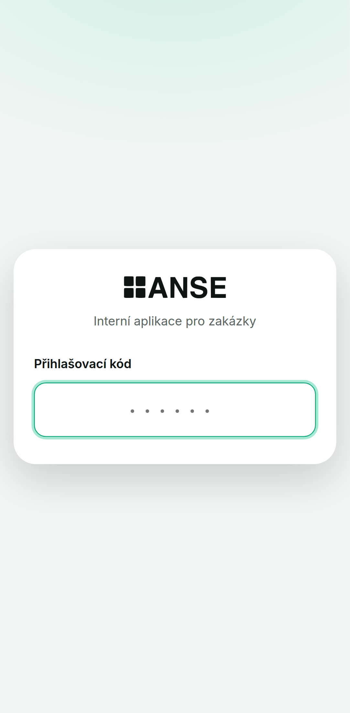

Plovoucí karta s logem, jediné pole na 6místný kód (`inputmode="numeric"`,
`autocomplete="one-time-code"`, monospace odsazení). **Odesílá se automaticky po šestém znaku.**
Stavy: idle · „Přihlašuji…" · chyba (červený rámeček + hláška, pole se vyprázdní a zafokusuje).

### 15.2 Dashboard — `/`
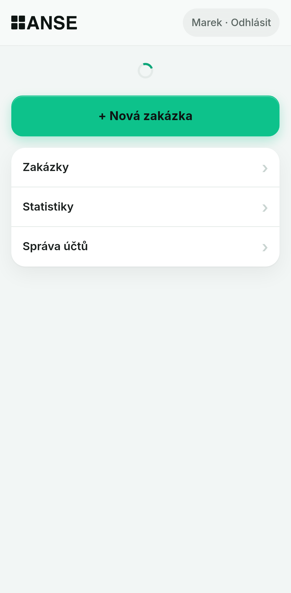

Čtyři dlaždice s počty aktivních stavů (Rozpracované, K nacenění, K objednávce, K montáži) —
proklik na filtrovaný seznam. Pod nimi primární **+ Nová zakázka** a menu karta s řádky
(Zakázky / Statistiky / Správa účtů).

**Technik vidí jen Zakázky** — Statistiky a Správa účtů jsou admin-only (i na úrovni routeru):
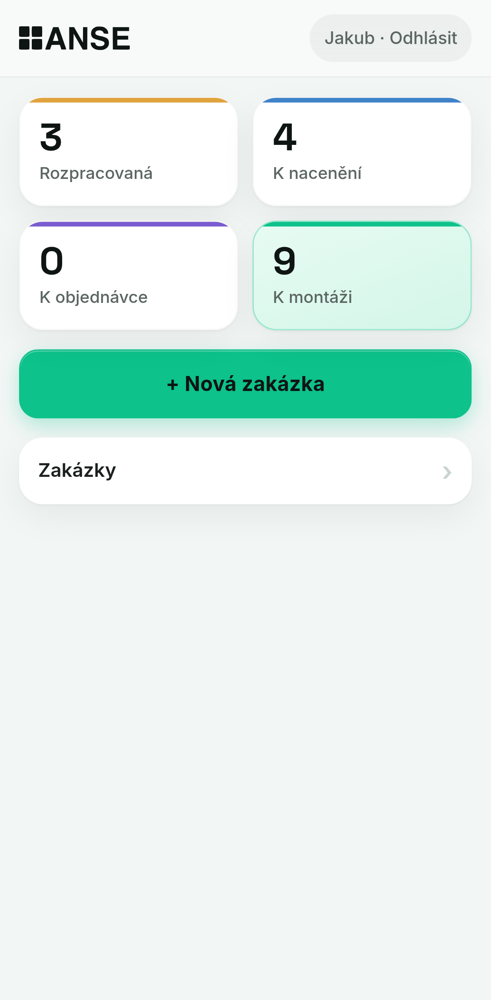

### 15.3 Seznam zakázek — `/zakazky`
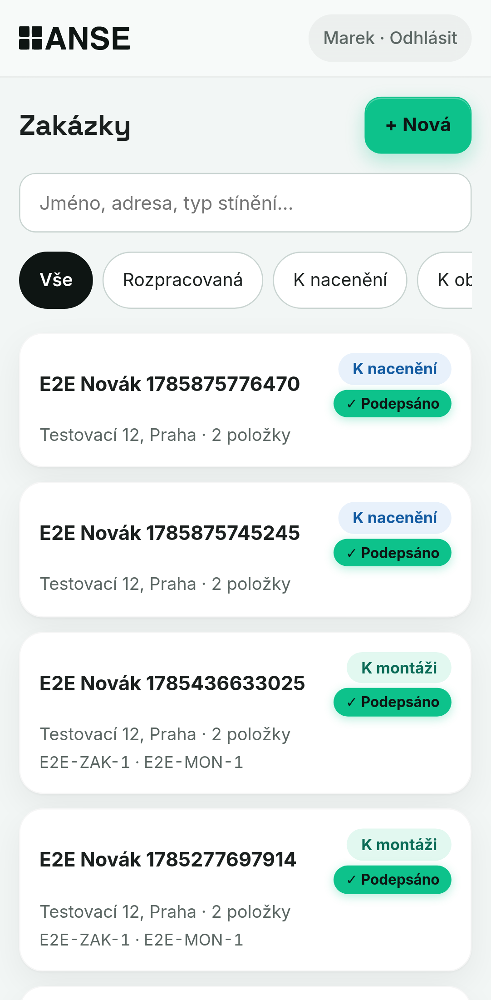

Hledání (jméno, adresa, typ stínění; debounce 300 ms, stav v URL), taby **Vše / Rozpracované /
K nacenění**. Karta: jméno zákazníka, stavový štítek, **✓ Podepsáno / Chybí podpis**, adresa,
počet položek, čísla. Stavy: spinner · chyba s „Zkusit znovu" · prázdný stav.

### 15.4 Nová zakázka — `/zakazky/nova`
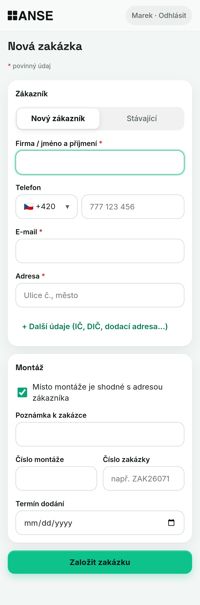

Sekce **Zákazník** (přepínač Nový / Stávající) a **Montáž**. Povinné: jméno, e-mail, adresa
(legenda „* povinný údaj"). Skryté doplňky za „+ Další údaje (IČ, DIČ, dodací adresa…)".
**Checkbox „Místo montáže je shodné s adresou zákazníka"** (default zaškrtnutý) — při odškrtnutí
se pole zobrazí a je povinné; jinak server doplní adresu klienta.
Technik vidí jen Místo montáže + Poznámku, admin navíc čísla a termín dodání.

Výběr stávajícího zákazníka — **admin má u každého řádku tužku a červený koš** (archivace):
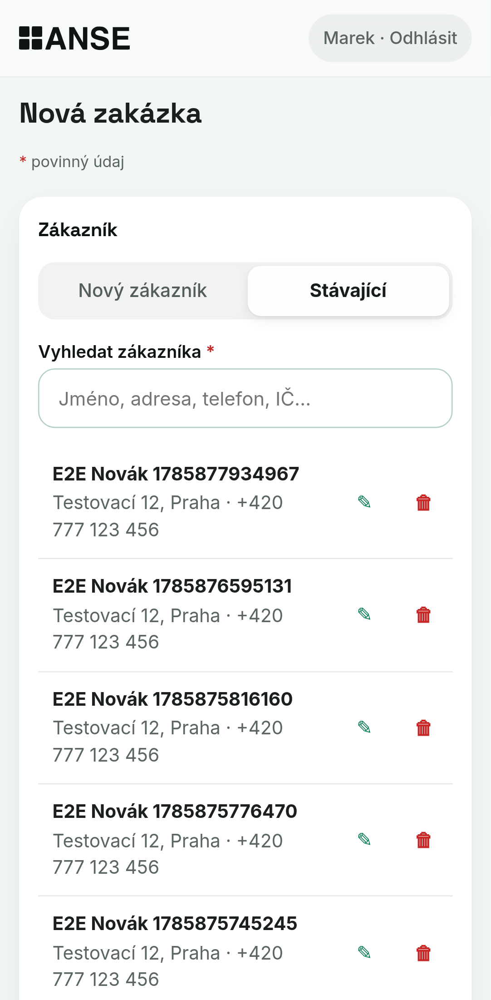

### 15.5 Detail zakázky — `/zakazky/:orderId`
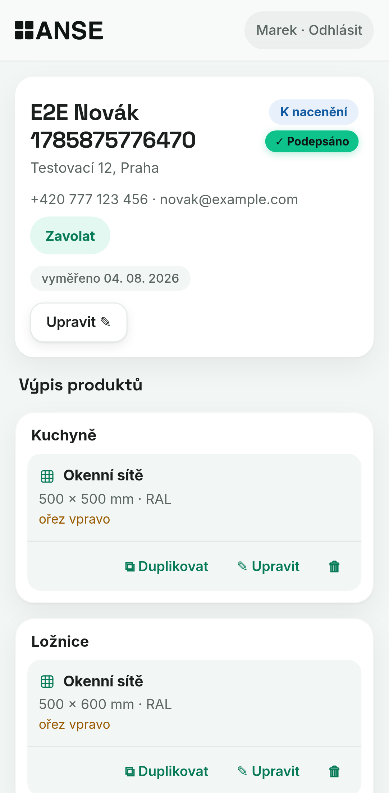

Hlavička: jméno, adresa montáže, stavový štítek + štítek podpisu, kontakt s pilulkou **Zavolat**,
čísla a termíny jako štítky, tlačítko **Upravit ✎** (rozbalí editaci — technik jen místo montáže,
termín vyměření a poznámku; admin i kartu zákazníka).

Sekce **Výpis produktů** — místnosti jako karty, položky s ikonou typu, souhrnem (`š × v mm · barva`)
a akcemi **⧉ Duplikovat / ✎ Upravit / 🗑**. Prázdná místnost jde smazat.

Dole: **+ Přidat produkt**, **Podepsat ✍**, kontextová akce stavu.

Admin sekce na spodku stránky:
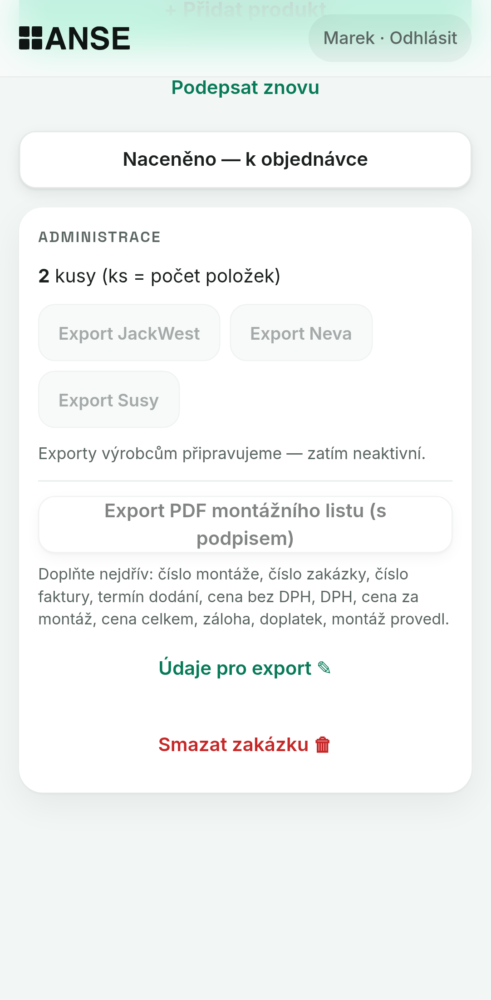

počet kusů · neaktivní exporty výrobců (JackWest / Neva / Susy) · **Export PDF montážního listu**
s hintem, co chybí · **Údaje pro export ✎** (čísla, faktura, termín dodání, 6 částek, montáž provedl
— ukládá i rozpracované) · **Smazat zakázku 🗑** (dvojtap).

### 15.6 Výběr typu produktu — `/zakazky/:orderId/polozka/nova`
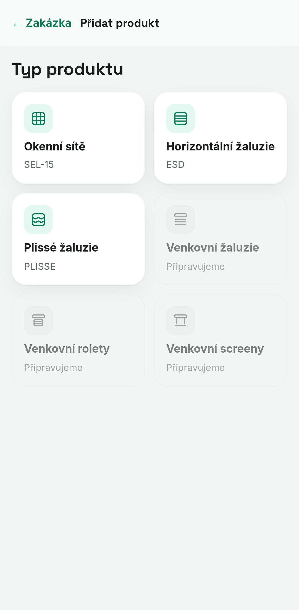

Fullscreen krok bez app hlavičky, návrat „← Zakázka". Dlaždice s ikonami; neaktivní typy šedé
s popiskem „Připravujeme".

### 15.7 Formulář položky
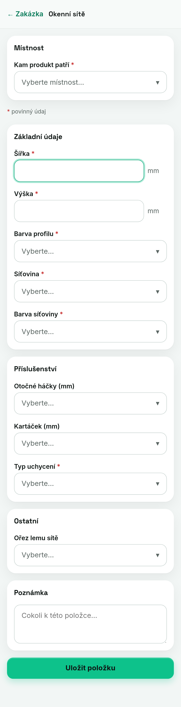

Renderuje `DefinitionForm` z definice. **Místnost je první pole** (SelectSheet s předvolbami +
vlastní název, pamatuje si poslední). Skupiny polí zrcadlí editor výrobce, hlášky jsou přímo
u polí, dole vestavěná Poznámka a **Uložit položku** (guard proti dvojtapu).
Rozepsaný formulář se **autosavuje do localStorage** (`useDraft`) a přežije zavření prohlížeče.

SelectSheet s náhledy barev:
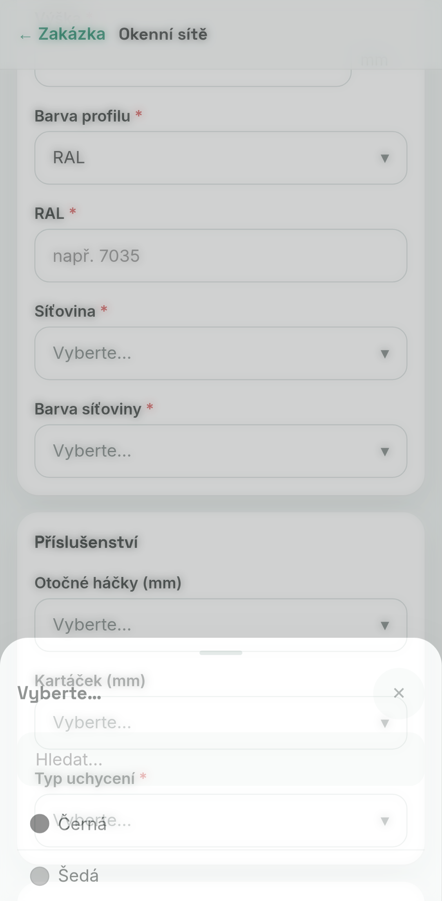

### 15.8 Podpisový pad
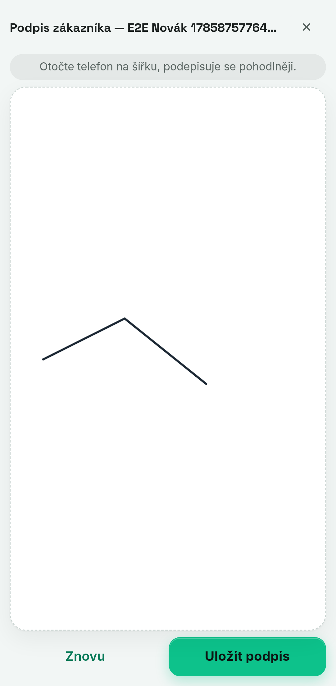

Viz §11.

### 15.9 Statistiky — `/statistiky` (admin)
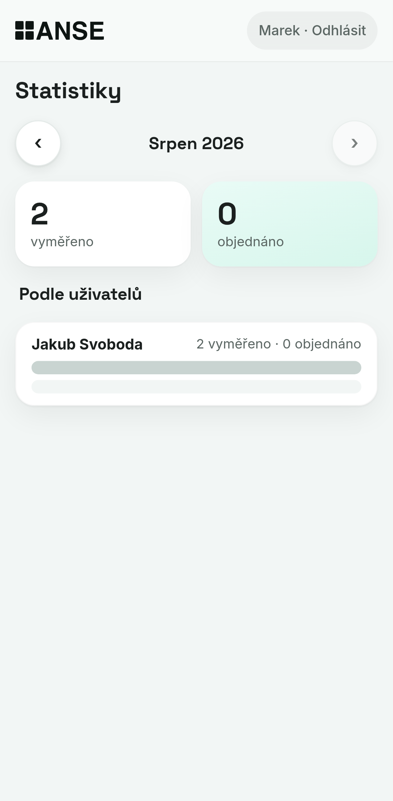

Měsíční pohled (šipky vlevo/vpravo), dvě velká čísla: **vyměřeno** (založené zakázky dle
`orders.created_by`) a **objednáno** (přechody na `k_objednavce` z `order_events`), pod tím
**Podle uživatelů** s poměrovými pruhy. TZ Europe/Prague.

### 15.10 Správa účtů — `/admin` (admin)
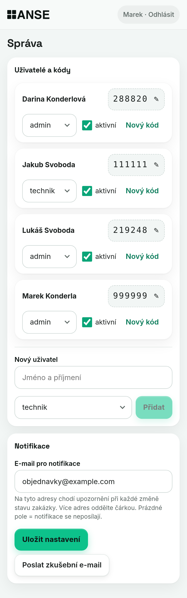

Uživatelé: jméno, role, **zobrazitelný/editovatelný přihlašovací kód** (blokuje triviální kódy),
přepínač aktivní, přidání uživatele s vygenerovaným kódem.
Sekce **Notifikace**: adresy + **Uložit nastavení** + **Poslat zkušební e-mail** s výsledkem.

---

## 16. Klientská vrstva

- **TanStack Query** — `staleTime` per dotaz (me 5 min, detail 10 s, seznam 15 s, číselníky 10 min).
  `useInvalidateOrder()` invaliduje detail + seznam + dashboard najednou.
- **`api()` wrapper** (`src/api/client.ts`) — `credentials: same-origin`, JSON, vyhazuje
  `ApiFetchError` se statusem a českou hláškou ze serveru; `isConflict(err)` = 409.
  Na 401 klient přesměruje na login.
- **Drafty** (`useDraft`) — klíč per zakázka+typ (nová položka) nebo per položka (editace),
  debounce, po úspěšném uložení se draft maže.
- **Toasty** — potvrzení akcí, u duplikace i akce „Upravit" vedoucí rovnou do kopie.
- **Stahování souborů** — přes `fetch` → blob → objectURL (ne prostý `<a download>`), aby se
  chyba serveru dala ukázat českým toastem.

---

## 17. Testy

**Vitest — 41 testů, 4 soubory:**
- `shared/form-engine/engine.test.ts` (25) — viditelnost, pruneHidden, povinnost jen když viditelné,
  `"0"` je platná hodnota, limity, pravidla `minArea`/`requireNote`, `tbd`.
- `shared/print.test.ts` (5) — agregace položek do řádků, slučování identických, `totalPieces`.
- `shared/codes.test.ts` (3) — formát a triviálnost kódů.
- `server/email.test.ts` (8) — parsování adresátů, předmět, HTML/text šablona, escapování.

**Playwright — 2 serial testy** (mobilní viewport, proti lokálnímu Postgresu):

1. **technik:** login → dashboard → nová zakázka (povinný e-mail blokuje, checkbox shodné adresy,
   technik nevidí admin pole ani ikony u zákazníků) → typ produktu → formulář (regrese šířky stránky,
   podmíněná pole, blokující pravidlo `requireNote`) → **duplikace → editace kopie** (regrese 409)
   → přesun mezi místnostmi → **Plissé s podmíněnými poli** (DaN → spodní látka, VS × BM) →
   **podpis přes canvas** → štítek Podepsáno → posun stavu.
2. **admin:** taby a hledání → štítek podpisu v seznamu → rámeček administrace na spodku →
   xlsx routa vrací 404 → **PDF gating** (disabled + hint, doplnění údajů → enabled → `%PDF-`) →
   posun stavu → statistiky → **smazání zakázky** → **správa zákazníků** (tužka, archivace) →
   **zkušební e-mail** (prázdná adresa → výzva; bez klíče → hláška o konfiguraci).

---

## 18. Build a nasazení

**Netlify** (site `anse-zakazky`, site_id `304da4ac-3c1e-4f45-b0aa-79a759731a5f`):

```toml
[build] command = "npm run build && npm run migrate && npm run seed"
        publish = "dist"
[functions] node_bundler = "esbuild"
[[redirects]] from = "/*" to = "/index.html" status = 200   # SPA fallback, neforcovaný
```

**Migrace a seed běží při každém deployi** (obojí idempotentní) — úprava JSON definice → push →
deploy = nová verze v DB, bez ručních kroků.

**Tři funkce:** `api` (`/api/*`), `export` (`/export/*`), `ping` (cron `*/5 * * * *`).
Cesty funkcí **musí být disjunktní** — překryv `/api/export/*` s `/api/*` byl reálný bug (§21.2).

**Deploy = merge do `main`** (rozhodnutí Lukáše: bez PR). Pracovní větev
`claude/anse-order-app-tpwc2r`, na `main` se dostává fast-forward pushem.

### Proměnné prostředí

| Proměnná | Kde | Popis |
| --- | --- | --- |
| `DATABASE_URL` | runtime | Supabase **transaction pooler** (6543) |
| `DIRECT_DATABASE_URL` | build, zálohy | Supabase **session pooler** (5432) |
| `JWT_SECRET` | runtime | min. 48 náhodných znaků |
| `SEED_ADMIN_CODE` | jen první seed | bootstrap kód, ať kódy nejdou do build logu |
| `RESEND_API_KEY` | runtime | bez něj se notifikace přeskakují |
| `RESEND_FROM` | runtime | `Anse <zakazky@anse.cz>` — musí být na ověřené doméně |
| `APP_URL` | runtime | základ odkazů v e-mailu |

> **Změna proměnné se projeví až novým buildem a deployem** — Netlify Functions dostávají hodnoty
> ve chvíli deploye. „Publish deploy" u staršího deploye je rollback a proměnné nepřevezme.
> Proměnné z `netlify.toml` se k funkcím vůbec nedostanou.

### Zálohy
Noční `pg_dump` přes GitHub Actions (`.github/workflows/backup.yml`, 02:30 UTC), artefakt 90 dnů.
Workflow si **zjistí major verzi serveru** a doinstaluje odpovídajícího klienta z PGDG (Supabase
běží na 17.x, runner má 16.x — viz past §21.5). Obnova: `psql $DIRECT_DATABASE_URL < dump.sql`.

---

## 19. Provozní runbook

- **Supabase pauza** (free tier, ~7 dní bez aktivity): brání jí `ping` funkce; kdyby přesto pauzlo →
  Supabase dashboard → Restore/Resume.
- **Ztracený přihlašovací kód:** admin ho vidí a mění ve Správě účtů. Když není žádný admin,
  nastavit `SEED_ADMIN_CODE` a spustit deploy.
- **Špatně posunutý stav:** vracení v UI neexistuje — oprava přímo v DB (`update orders set status`),
  případně dorovnat `order_events`.
- **Notifikace nechodí:** Správa účtů → Notifikace → *Poslat zkušební e-mail*; hláška řekne přesnou
  příčinu. Nejčastěji chybí nový deploy po přidání klíče, nebo doména není v Resendu ověřená.
- **Zálohy padají:** zkontrolovat secret `DIRECT_DATABASE_URL` v GitHubu a verzi Postgresu.

---

## 20. Známé mezery a co čeká na podklady

| Téma | Stav |
| --- | --- |
| Venkovní žaluzie, rolety, screeny | čekají na parametry od klienta (neaktivní dlaždice) |
| Vzorník látek Plissé (~400 položek) + dopočet skupiny | čeká; zatím textové číslo |
| Barva příchytky (Plissé) | `tbd` — chybí rozbalený stav z podkladů |
| 4 barvy lamel ESD bez fotky | kódy 814, 1010, 2002, 8202 |
| Export objednávky pro výrobce (JackWest CSV/xlsx) | tlačítka deaktivovaná, čeká se na vzorové CSV pro Ariscat |
| Notifikace v provozu | čeká na DNS záznamy a `RESEND_API_KEY` (§13) |
| DMARC pro anse.cz | volitelné, řešit až po ověření domény |
| Odpovědi na notifikace | `zakazky@anse.cz` je jen odchozí — buď založit schránku, nebo doplnit `reply_to` |
| Statistiky | jen měsíční pohled; „objednáno" = přechod na `k_objednavce` |

---

## 21. Pasti, na které jsme narazili (nešlapat do nich znovu)

**21.1 Mikrosekundy vs. milisekundy v optimistickém zámku.**
`postgres.js` převádí ISO-datum-vypadající string parametr přes JS `Date` → mikrosekundy se ořežou
na milisekundy → porovnání `updated_at = $expected` **nikdy nesedělo** a každá editace končila 409.
Fix: **`timestamptz(3)` u všech `updated_at`** (migrace 002). Nikdy nevracet µs přesnost do klienta.

**21.2 Kolize cest dvou Netlify funkcí.**
`api.ts` na `/api/*` a export na `/api/export/*` — request občas skončil v api routeru → 404 JSON →
prohlížeč hlásil jen „unable to download". Fix: **disjunktní prefix `/export/*`**.

**21.3 Dvojí uložení a falešný 409.**
Editace hlavičky posílá dva requesty (zakázka + karta klienta). Když druhý spadl na validaci,
opakovaný pokus narazil na **vlastní** předchozí zápis → 409. Fix: validovat povinná pole **před**
odesláním a po každém dílčím úspěchu obnovit `expected_updated_at`.

**21.4 Auto-margin ve flex sloupci.**
`.page { margin: 0 auto }` jako přímý potomek flex column zrušilo stretch a stránka se smrskla na
šířku obsahu (na iPhonu 349 px místo 430). Fix: `.page { width: 100% }`. E2E to hlídá měřením šířky.

**21.5 `pg_dump` odmítá novější server.**
Supabase 17.x vs. klient 16.x na GitHub runneru → záloha padala každou noc. Fix: zjistit verzi
serveru a doinstalovat klienta z PGDG (`apt.postgresql.org.sh`).

**21.6 Wildcard v DNS zóně `anse.cz`.**
`*.anse.cz` je CNAME na apex, takže **každá neexistující subdoména odpovídá** — překlep v DNS se
netváří jako chyba a `send.anse.cz` dnes „má" cizí MX. Explicitní záznam wildcard přebije (RFC 4592),
ale kontrolovat se musí **typ odpovědi**, ne to, že se jméno přeloží. Wildcard **nesmí být smazán**
(drží `www.anse.cz`).

**21.7 České uvozovky.**
`„…"` v `git commit -m` rozbíjí shell (commit message psát přes heredoc do souboru), v JSX atributu
rozbíjí TSX (obalit `{"…"}`).

**21.8 Netlify env bez redeploye.**
Uložení proměnné v UI se na běžící aplikaci neprojeví — viz §18.

---

## 22. Historie klíčových rozhodnutí

| Datum | Rozhodnutí |
| --- | --- |
| 16. 7. | Stack (Vite+React+TS, Netlify free, Supabase přes postgres.js), datový model, schéma definic, plaintext kódy, RLS deny-all. Nová zakázka vzniká rovnou „Rozpracovaná". |
| 16. 7. | Tisk montážního listu až po Milníku 1 (tlačítko viditelné, deaktivované). |
| 17. 7. | Feedback vlna 2: **3 stavy, jen vpřed**; položka bez počtu kusů (řeší duplikace); místnost jako pole formuláře; žádné defaulty v selectech („Vyberte…"); vlastní SelectSheet místo nativního selectu. |
| 28. 7. | Digitální podpis + PDF montážního listu; povinné jméno/adresa/e-mail zákazníka; legenda povinných polí. |
| 30. 7. | **xlsx export zrušen**, PDF ho nahradilo; rámeček exportů přesunut na spodek detailu. |
| 4. 8. | Mazání zakázek (admin, kaskáda); oddělené „Údaje pro export"; archivace zákazníků; **vizuální upgrade** (Inter + Space Grotesk, skutečné logo, smaragdová #0DC28B, glass lišty); SVG ikony produktů. |
| 5. 8. | **Pět fází zakázky** (rozpracovaná → k nacenění → k objednávce → k montáži → hotovo) + e-mailové notifikace změn stavu. |
| 11. 8. | Plissé jako třetí aktivní produkt; zkušební e-mail v Nastavení; runbook pro Resend. |

Schválená rozhodnutí se zapisují do Notionu (DB Zápisky, Typ = Rozhodnutí, relace na projekt).

---

## 23. Konvence pro další práci

- **Malé commity, popis česky.** Zpráva = co a **proč**, ne výčet souborů.
- **Nikdy neměnit existující migraci** — vždy nová `NNN_nazev.sql`, idempotentní
  (`add column if not exists`, `drop constraint if exists`).
- **Nová funkčnost = i test.** Regrese, které stály čas (409, šířka stránky, gating PDF), mají
  v E2E svůj krok s komentářem proč.
- **Změna definice produktu** = nový JSON + `validate:definitions` + seed (vytvoří novou verzi).
  Nikdy needitovat definici v DB ručně.
- **Nový stav zakázky** = migrace (CHECK + přemapování) + `shared/types.ts`
  (`ORDER_STATUSES`, `STATUS_LABELS`, `ALLOWED_TRANSITIONS`) + `ACTIONS` v `OrderAction.tsx`
  + CSS třídy `.status-*` + dlaždice na dashboardu + taby v seznamu.
- **Nová routa** = `makeRoute` + zod kontrakt v `shared/api-contracts.ts` + role flag.
  Server vždy revaliduje, klient nikdy nerozhoduje o autorizaci.
- **Tajemství nikdy do repa ani do chatu** — jen do Netlify env (a `.env.example` jen s popisem).
- **Před deployem:** `npm run build` (tsc + vite), `npx vitest run`, `npm run test:e2e`.
